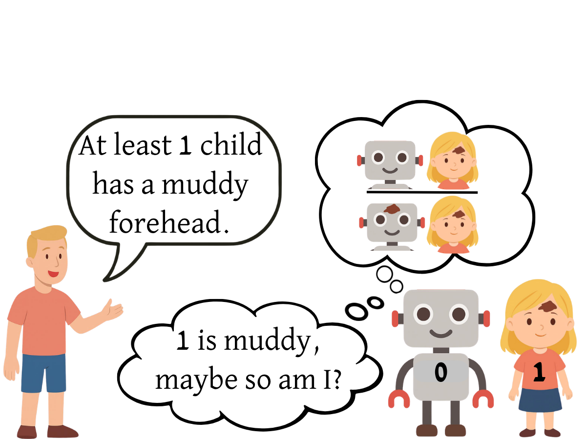
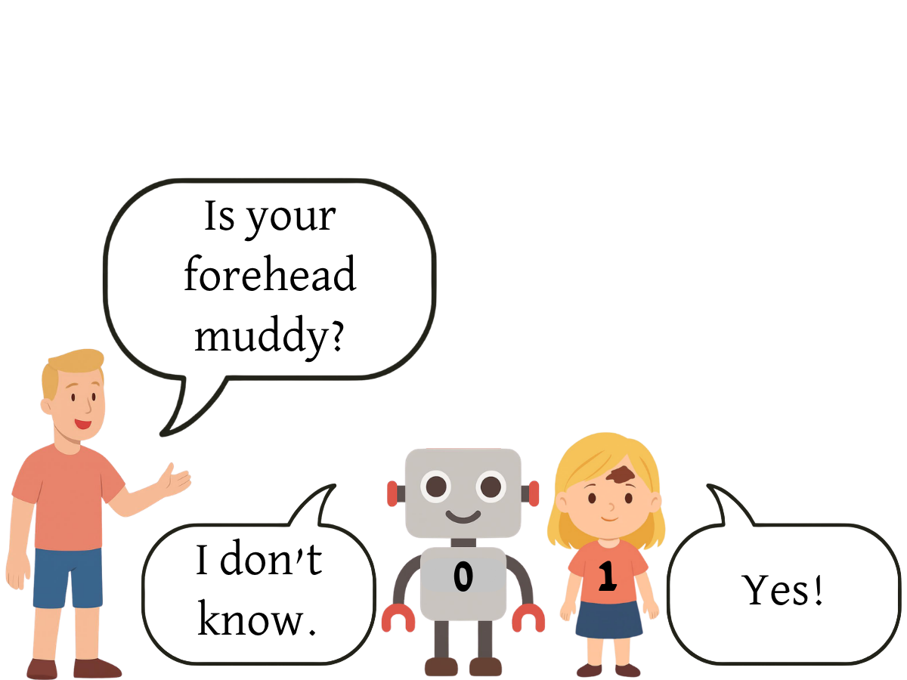
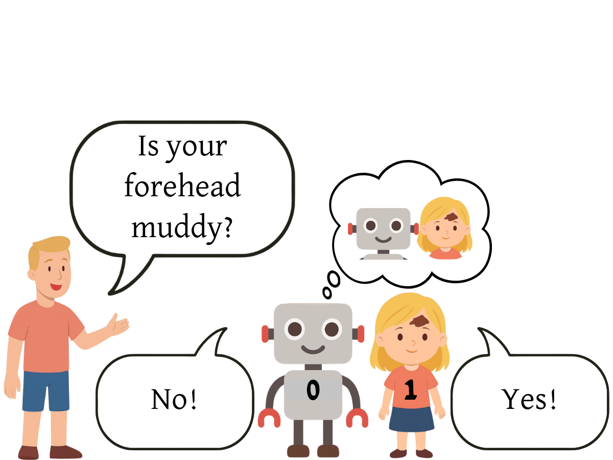
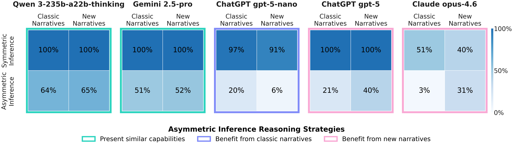

# Beyond Memorization: Distinguishing Between Pattern-Based and Epistemic Reasoning in LLMs Using Epistemic Puzzles

A two-dimensional benchmark of DEL-style epistemic puzzles, varying narrative familiarity and inference complexity, 
for distinguishing pattern-based from epistemic reasoning in LLMs.

Every puzzle instance asks one queried agent, in a specific reasoning round, whether it can deduce a
hidden binary status about itself (muddy/clean, blue-eyed/brown-eyed, passed/failed, etc.) given:

- A public announcement bounding how many agents have the positive status.
- What the agent can currently observe about the other agents.
- The "I know" / "I don't know" answers of all agents from the previous rounds.

The ground truth is produced by an internal epistemic solver (a possible-worlds Kripke-model
simulation), so every instance has a single correct `Yes` / `No` / `I don't know` answer.

<p align="center">
  
</p>

## How a puzzle works

The classic setup (symmetric inference): every agent sees every other agent's status but not their
own. For example, in the Muddy Children narrative, consider 2 children where child 1 is muddy and child 0 is not:

|                1. Public announcement: Following the announcement, child 1 eliminates the possibility that both children are clean.                 |                        2. Round 1: Child 0 cannot rule out possibilities based on the public announcement, while child 1 knows she is muddy.                         | 3. Round 2: Child 0 knows he is clean, since if he were muddy, child 1 would have remained uncertain. |
|:---------------------------------------------------------------------------------------------------------------------------------------------------:|:--------------------------------------------------------------------------------------------------------------------------------------------------------------------:|:-----------------------------------------------------------------------------------------------------:|
|                                                                                              |                                                                                                           |              |


The framework also supports an **asymmetric (random observation)** setting, where each agent only
sees an arbitrary subset of the other agents (an explicit visibility matrix) instead of "everyone but
myself." Ground truth in that setting is computed by an explicit possible-worlds simulation rather
than the closed-form formula used in the symmetric case.

Both settings are rendered under **seven narratives**: three classic puzzles (Muddy Children,
Blue-Eyed Islanders, Wise Men) and four new story variations introduced in this work (Olympic
Games, Singing Contest, Health Screening, Safety Inspection) that describe the exact same underlying
logical scenario in a different setting, to test whether models perform pattern-based reasoning
rather than reasoning from first principles.

## Repository structure

```
.
├── README.md                                            # this file
├── requirements.txt                                     # Python dependencies
├── figures/                                             # paper figures
├── src/
│   ├── README.md                                        # src/ overview
│   ├── main.py                                          # `generate` / `test` CLI entry point
│   ├── cli_input_validation.py                          # argparse definitions and validation
│   ├── constants.py                                     # boundary types, puzzle IDs, CSV columns, answer regex
│   ├── models.py                                        # model registry (OpenAI / Gemini / OpenRouter clients)
│   ├── puzzles.py                                       # PUZZLE_CONFIGS: the 7 narrative phrasings
│   ├── dataset_generation/
│   │   ├── README.md                                    # dataset generator internals + reproduction commands
│   │   ├── dataset_generator.py                         # core generator
│   │   ├── internal_solver.py                           # ground-truth label computation
│   │   ├── boundary_utils.py                            # boundary announcement helpers
│   │   ├── standard_observation_text_generator.py       # closed-form symmetric-setting logic + text
│   │   ├── random_obs_text_generator.py                 # possible-worlds asymmetric-setting logic + text
│   │   ├── asymmetric_dataset_generation_script.py      # one-off: generates the asymmetric dataset
│   │   ├── convert_to_different_settings_symmetric.py   # re-skin a symmetric dataset to a new narrative
│   │   └── convert_to_different_settings_asymmetric.py  # re-skin an asymmetric dataset to a new narrative
│   ├── utils/
│   │   ├── README.md
│   │   ├── filter_first_deduction.py                    # keep each scenario's first deduction round only
│   │   ├── csv_utils.py                                 # incremental CSV writers
│   │   └── solver_runner_with_display.py                # verbose single-scenario solver trace
│   └── analysis/
│       ├── README.md
│       ├── quadrant_files.py                            # QUARTERS: file manifest for the 4 benchmark quadrants
│       ├── compute_quadrant_accuracy.py                 # per-quadrant accuracy heatmap figure
│       └── compute_quadrant_macro_f1.py                 # per-quadrant macro-F1 table (text + LaTeX)
└── test_results/
    ├── symmetric_inference/<puzzle_name>/               # generated datasets + per-model eval CSVs
    └── asymmetric_inference/<puzzle_name>/              # generated datasets + per-model eval CSVs
```

## Installation

```bash
git clone <this-repo-url>
cd Epistemic_Logic_Research_Project
python -m venv .venv && source .venv/bin/activate
pip install -r requirements.txt
```

Evaluating models (`src.main test`) calls the providers configured in `src/models.py` and requires
the corresponding API keys as environment variables:

```bash
export OPENAI_API_KEY=...        # GPT-5 / GPT-5 nano
export GEMINI_API_KEY=...        # Gemini 2.5 Pro
export OPENROUTER_API_KEY=...    # Qwen3-235B-thinking, Claude Opus (routed via OpenRouter)
```

## Reproducing the experiment datasets

All datasets below use **10 agents** and the **lower-bound** announcement ("at least *q* agents have
the positive status"), matching the CSVs checked into `test_results/`. Run every command from the
repository root.

### 1. Symmetric inference &mdash; Muddy Children (base dataset)

First generate every reasoning round for every valid scenario under the symmetric ("everyone sees
everyone but themselves") observation setup:

```bash
python -m src.main generate \
    --number_of_agents 10 \
    --boundary_types lower \
    --puzzles muddy_children \
    --dataset_path test_results/symmetric_inference/muddy_children/muddy_children_puzzles_dataset.jsonl
```

This sweeps all muddy counts, boundary values, and rounds 1..11 for `n=10` and writes both a
`.jsonl` and a `.csv`. Then filter it down to, for each scenario, only the earliest round in which
the queried agent can actually deduce its status:

```bash
python -m src.utils.filter_first_deduction \
    --input  test_results/symmetric_inference/muddy_children/muddy_children_puzzles_dataset.jsonl \
    --output test_results/symmetric_inference/muddy_children/muddy_children_puzzles_dataset_first_deduction.jsonl
```

(These two steps can be run in one call with `filter_first_deduction.py --run-generate
--number_of_agents 10 --boundary_types lower`, see `src/utils/README.md`.)

This produces the 100-row `muddy_children_puzzles_dataset_first_deduction.jsonl` / `.csv` already in
the repo.

### 2. Asymmetric inference &mdash; Olympic Games (base dataset)

The asymmetric seed dataset is produced by a fixed, parameter-free script (`n=10`, queried agent 0,
lower bound `q=8`, seed 1) that samples random observation matrices and keeps only the 100 scenarios
whose first-deduction round is exactly round 3:

```bash
python -m src.dataset_generation.asymmetric_dataset_generation_script
```

This writes `asymmetric_inference_olympic_games.jsonl` / `.csv` to the current working directory.
Move them into place and rename to match the rest of the asymmetric datasets:

```bash
mv asymmetric_inference_olympic_games.jsonl \
   test_results/asymmetric_inference/olympic_games/olympic_games_additional_analysis.jsonl
mv asymmetric_inference_olympic_games.csv \
   test_results/asymmetric_inference/olympic_games/olympic_games_additional_analysis.csv
```

### 3. Re-skinning both base datasets to the other 6 narratives

The two base datasets above (`muddy_children`, symmetric; `olympic_games`, asymmetric) are re-skinned
into the remaining narratives with the same underlying scenarios, matrices, and ground-truth labels,
just a different story. For the symmetric dataset, run for each of the remaining puzzle types:

```bash
for puzzle in blue_eyed_islanders wise_men olympic_games health_screening safety_inspection singing_contest; do
  python -m src.dataset_generation.convert_to_different_settings_symmetric \
      --srcs test_results/symmetric_inference/muddy_children/muddy_children_puzzles_dataset_first_deduction.jsonl \
      --dst  "test_results/symmetric_inference/${puzzle}/closed_inference_${puzzle}" \
      --puzzle_type "${puzzle}"
done
```

And for the asymmetric dataset:

```bash
for puzzle in muddy_children blue_eyed_islanders wise_men health_screening safety_inspection singing_contest; do
  python -m src.dataset_generation.convert_to_different_settings_asymmetric \
      --srcs test_results/asymmetric_inference/olympic_games/olympic_games_additional_analysis.jsonl \
      --dst  "test_results/asymmetric_inference/${puzzle}/${puzzle}_additional_analysis" \
      --puzzle_type "${puzzle}"
done
```

Together, steps 1&ndash;3 reproduce all 14 dataset files (7 narratives &times; 2 inference types) under
`test_results/`. See `src/dataset_generation/README.md` for details on how re-skinning works.

## Evaluating models on a dataset

```bash
python -m src.main test \
    --dataset_path   test_results/symmetric_inference/muddy_children/muddy_children_puzzles_dataset_first_deduction.jsonl \
    --output_prefix  test_results/symmetric_inference/muddy_children/muddy_children_puzzles_dataset_first_deduction
```

This runs every model configured in `src/models.py` (edit that file to add/remove models) over every
row of the dataset and incrementally writes:

- `<output_prefix>_pre_process.csv` &mdash; raw model response + extracted chain-of-thought (for
  models that support it).
- `<output_prefix>_post_process.csv` &mdash; just the first line of the response (the parsed
  `Yes` / `No` / `I don't know` answer), no chain-of-thought.

## Other dataset generator features

`python -m src.main generate` supports more than the single "10 agents, lower bound, muddy children"
configuration used above:

| Flag | Effect                                                                                                                                                                                                                                                                                                         |
|---|----------------------------------------------------------------------------------------------------------------------------------------------------------------------------------------------------------------------------------------------------------------------------------------------------------------|
| `--number_of_agents 5 10 15 ...` | Sweep multiple agent counts in one run (space-separated).                                                                                                                                                                                                                                                      |
| `--boundary_types lower upper at_least_clean not_less_than` | Sweep multiple announcement phrasings. `upper` = "at most *q*"; `at_least_clean` announces a bound on the *clean/negative* count instead of the muddy/positive one; `not_less_than` is a "not less than *q*" phrasing of the same lower-bound logic.                                                           |
| `--puzzles muddy_children wise_men ... ` | Generate multiple narratives in a single run (any subset of the 7 in `PUZZLE_CONFIGS`, see `src/puzzles.py`).                                                                                                                                                                                                  |
| `--agent_index` | Which agent's perspective the puzzle is asked from (default: agent 0). Must be `< min(number_of_agents)`.                                                                                                                                                                                                      |
| `--special_name` | Replaces the queried agent's generic role name with a real-world persona (e.g. "Simone Biles" / "Lizzo" for Olympic Games) drawn from `SPECIAL_NAME_MAP` in `src/constants.py`. Currently only defined for `olympic_games` and `singing_contest`; not supported for `muddy_children`.                          |
| `--random_observation` | Use an explicit, randomly sampled visibility matrix per instance instead of the classic "everyone but myself" setup (the asymmetric setting, without extra filtering).                                                                                                                                         |
| `--random_observation_extreme` | A harder asymmetric mode: the queried agent additionally cannot see itself, uninformative bounds ("at least 0" / "at most n") are excluded, and only scenarios where the agent needs at least 3 rounds to deduce its status are kept. This is what `asymmetric_dataset_generation_script.py` builds on top of. |
| `--insert_solution_approach` | Appends a `[Solution Approach]` section to the puzzle instructing the model to explicitly build and use a Kripke-model (possible-worlds) solver before answering, a guided-reasoning variant of the same puzzles.                                                                                              |

`--random_observation` and `--random_observation_extreme` are mutually exclusive.

## Reproducing the paper's analysis figures/tables

Evaluation CSVs are grouped into four quadrants (classic vs. new narratives &times; symmetric vs.
asymmetric inference) via the manifest in `src/analysis/quadrant_files.py`:

```bash
python -m src.analysis.compute_quadrant_accuracy     # Graphs/combined_models_accuracy.png
python -m src.analysis.compute_quadrant_macro_f1     # per-quadrant macro-F1 table (stdout, + LaTeX)
```

<p align="center">
  
</p>

See `src/analysis/README.md` for what each quadrant contains and how to point these scripts at your
own result files.

## `figures/`

Standalone image assets used in the accompanying paper:
the benchmark-quadrant diagram (`Main Figure.png`), the walked-through 2-agent example
(`public_announcement.png`, `round_1.png`, `round_2.png`), the results heatmap
(`combined_models_accuracy.png`), and rendered example prompts for each narrative (`25.png`&ndash;`39.png`).
