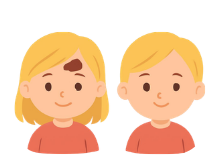
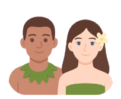

# `src/`

Top-level package for the puzzle generate & test framework. Everything is run as a module, e.g. `python -m
src.main generate ...`, from the repository root.

For dataset-generation and evaluation reproduction commands, see the [main README](../README.md).
For the internals of each subpackage, see:

- [`dataset_generation/README.md`](dataset_generation/README.md) &mdash; the puzzle generator, the
  epistemic solvers (symmetric closed-form and asymmetric possible-worlds), and the scripts used to
  build and re-skin the experiment datasets to different narratives.
- [`utils/README.md`](utils/README.md) &mdash; dataset post-processing and result-CSV writing.
- [`analysis/README.md`](analysis/README.md) &mdash; turning per-model result CSVs into the
  benchmark's accuracy/F1 figures and tables, plus pairwise model significance testing.

## Files in this directory

### `main.py`

The CLI entry point, dispatching two subcommands (defined in `cli_input_validation.py`):

- **`generate`** &mdash; delegates to `src.dataset_generation.dataset_generator.generate` with the
  parsed parameters (agent counts, boundary types, narratives, observation setting, etc.).
- **`test`** &mdash; loads a generated `.jsonl` dataset, builds a prompt per row
  (`premise + hypothesis`), derives the expected answer from `solver_label` and the queried agent's
  true status, calls every model configured in `models.py`, normalizes the first line of the
  response against `RESPONSE_FORMAT`, and appends a `PASSED`/`FAILED` verdict row to both
  `<output_prefix>_pre_process.csv` (raw response + chain-of-thought) and
  `<output_prefix>_post_process.csv` (first line only) via `utils/csv_utils.py`.

```bash
python -m src.main generate --number_of_agents 10 --boundary_types lower --puzzles muddy_children \
    --dataset_path path/to/dataset.jsonl

python -m src.main test --dataset_path path/to/dataset.jsonl --output_prefix path/to/results/run1
```

### `cli_input_validation.py`

Builds the `argparse` parser for both subcommands and validates constraints argparse can't express
on its own: non-empty/deduplicated list arguments, `--agent_index` within range of the smallest
requested agent count, `--special_name` rejected for `muddy_children`, `--random_observation` and
`--random_observation_extreme` being mutually exclusive, and that input/output paths exist or can be
created. Run `python -m src.main generate --help` / `python -m src.main test --help` for the full
flag reference.

### `constants.py`

Shared constants used across the whole package:

- Boundary type identifiers (`lower`, `upper`, `at_least_clean`, `not_less_than`) and their
  announcement-text prefixes.
- Puzzle-type identifiers for the seven narratives.
- `SPECIAL_NAME_MAP` &mdash; the real-world personas usable with `--special_name`.
- `COLUMNS` &mdash; the canonical column order for evaluation result CSVs.
- Canonical answer strings (`Yes` / `No` / `I don't know`) and `RESPONSE_FORMAT`, the regex used to
  parse a model's answer out of the first line of its response (tolerant of a trailing period and
  curly vs. straight apostrophes in "don't").

### `models.py`

The model registry evaluated by `src.main test`. Reads `OPENAI_API_KEY`, `GEMINI_API_KEY`, and
`OPENROUTER_API_KEY` from the environment and instantiates one client per provider (OpenAI native,
Gemini native, and OpenRouter via the OpenAI-compatible API). `MODELS` maps each model id to its
display name/version (used in result CSVs), which client to call it through, and whether to request
chain-of-thought. `NO_TEMPERATURE_MODELS` lists models that reject an explicit `temperature=0`
(currently the GPT-5 family, which is run at its default temperature). Add or remove a model by
editing the `MODELS` dict; a client whose API key isn't set is `None`, and calling a model routed
through it will fail at call time.

### `puzzles.py`

`PUZZLE_CONFIGS`: the phrasing dictionary for each of the seven narratives (agent nouns, the
announcing authority, the setup/observation text for both the classic and random-observation
settings, positive/negative status vocabulary, the question posed each round, and the
knew/didn't-know phrasings used to summarize previous rounds). Adding an eighth narrative means
adding one complete entry here with the same keys as the existing ones.

Three narratives are the classic puzzles from the epistemic logic literature (`muddy_children`,
`blue_eyed_islanders`, `wise_men`); four are new story variations introduced in this project
(`olympic_games`, `singing_contest`, `health_screening`, `safety_inspection`) that render the exact
same underlying logical scenario in an unfamiliar setting.

### The seven narratives

Each row below is the same public-announcement puzzle, rendered under a different `--puzzles` value.
The positive/negative status is what the queried agent is trying to determine about itself each
round (`pos_state`/`neg_state` in `PUZZLE_CONFIGS`).

| | `puzzle_type` | Agents / announcer | Positive status | Negative status |
|:---:|---|---|---|---|
|  | `muddy_children` *(classic)* | children / father | muddy forehead | clean forehead |
|  | `wise_men` *(classic)* | wise men / king | blue hat | white hat |
|  | `blue_eyed_islanders` *(classic)* | islanders / foreigner | blue eyes | brown eyes |
|  | `safety_inspection` *(new)* | tenants / safety warden | unit passed (green lanyard) | needs repairs (red lanyard) |
|  | `health_screening` *(new)* | patients / nurse | clear result | needs follow-up |
|  | `olympic_games` *(new)* | gymnasts / coach | made the final | did not make the final |
|  | `singing_contest` *(new)* | singers / host | V sticker (made the list) | X sticker (didn't make the list) |
